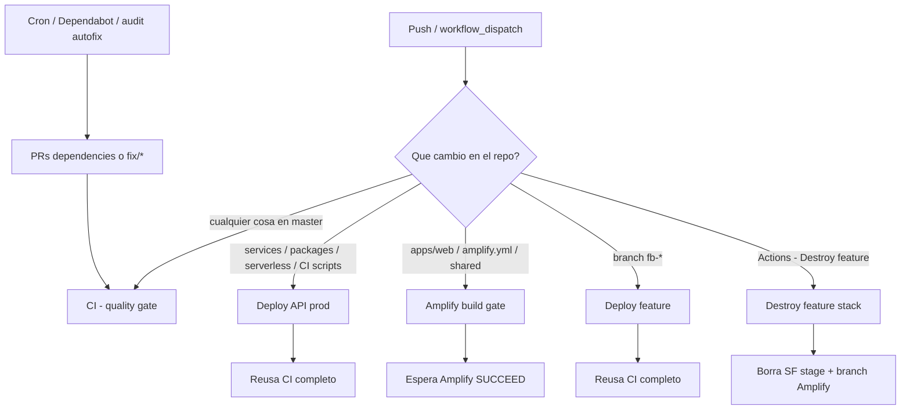
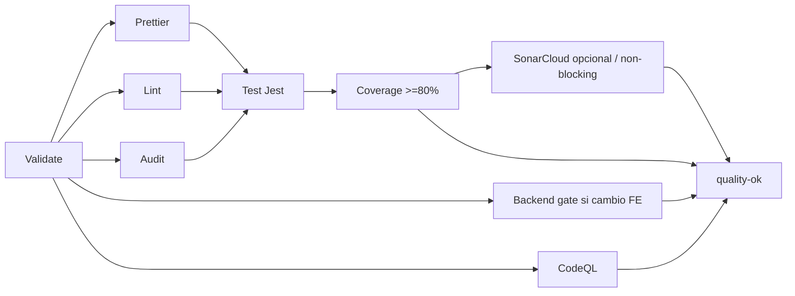
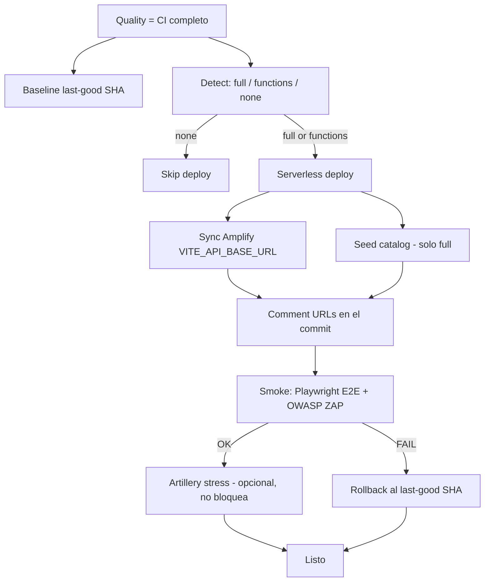
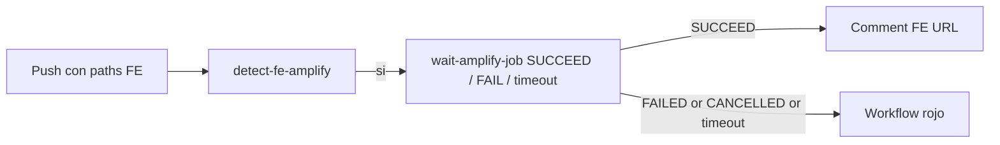
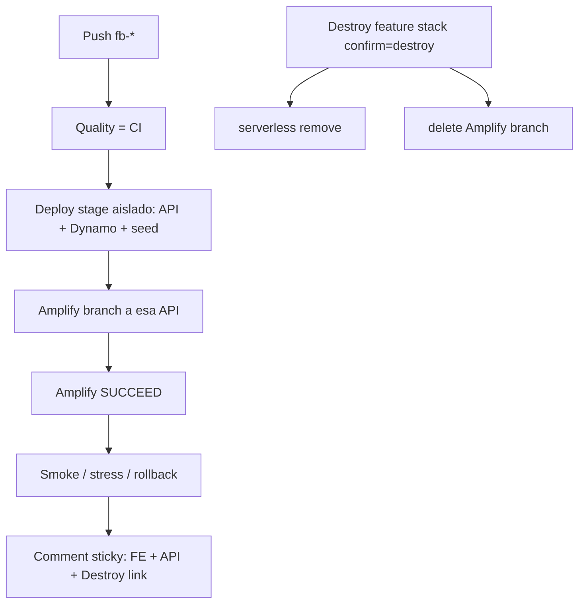

# 🛒 NORA — Checkout Store

Hola 👋 Si llegaste hasta acá a evaluar la prueba: **gracias**. Este README es la charla rápida (sin novelas de tablas).  
Repo público: [`DanielMat97/checkout-store-fullstack-test`](https://github.com/DanielMat97/checkout-store-fullstack-test) · Rúbrica hiring bar: **150/150** → [`docs/scorecard.md`](docs/scorecard.md) · foto del estado → [`docs/current-state.md`](docs/current-state.md).

---

## 🎯 En una frase

SPA premium para comprar un producto con tarjeta + entrega, pagar contra una pasarela **sandbox**, ver el resultado y bajar stock — todo en AWS, con Nest, Serverless Framework 4, DynamoDB y un pipeline que no deja pasar basura.

---

## 🔗 Tocá esto primero (prod)

- 🌐 **Web:** https://master.dw2i8myh0xumx.amplifyapp.com  
- ☁️ **API:** https://qo9kbfxew8.execute-api.us-east-1.amazonaws.com  
- 📄 **OpenAPI (JSON):** https://master.dw2i8myh0xumx.amplifyapp.com/openapi.json  
- 📚 **Docs interactivas (Apidog):** https://7j6npb6n4w.apidog.io — se actualiza sola ~cada **3 horas** ([por qué / cómo](docs/api/apidog.md))

Probalo en 20 segundos: abrí el FE, o hacé `GET …/products`. El journey real es: producto → tarjeta/entrega → summary → pay → status → stock.

Local: `http://localhost:5173` + API `http://localhost:3000`.

---

## 🚶 El journey (lo que el brief pedía)

1. Catálogo con stock  
2. Modal de tarjeta (Luhn / Visa–MC) + datos de entrega  
3. Resumen con fees  
4. Pago real (en prod: modo **sandbox**)  
5. Status APPROVED / DECLINED / ERROR  
6. Stock que baja cuando aprueba  

Bonus ops: pantalla **`/orders`** para listar aprobadas, restaurar stock y marcar delivery como cumplida.

Tarjeta fake local: `4111…1111`, fecha futura, CVV `123`.  
Detalle del adaptador (sin marca del proveedor en el repo): [`docs/payment-adapter.md`](docs/payment-adapter.md).

---

## 🧠 Por qué armamos la solución así

El brief pide **cuatro dominios**. Por eso hay cuatro Nest microservicios (`products`, `customers`, `deliveries`, `transactions`) y no un monolito disfrazado.

Un solo **HTTP API** (Serverless Framework 4) enruta `/products/**` → Lambda products, etc. El FE solo conoce **una** `VITE_API_BASE_URL`. Menos CORS, menos drama (ADR [0006](docs/adr/0006-single-api-gateway.md)).

**DynamoDB + ElectroDB** single-table: encaja con Lambda, un table por stage (`checkout-store-prod`, `checkout-store-fb-…`). Sin RDS “porque sí”.

**Hexagonal + neverthrow (ROP):** controllers flacos, reglas en use-cases, errores de dominio → HTTP en un mapper compartido. Se testea sin AWS (ADR [0001](docs/adr/0001-hexagonal-architecture.md), [0009](docs/adr/0009-neverthrow-rop.md)).

**Amplify** hostea el SPA (HTTPS, branches `fb-*`).  
**SQS** desacopla “bajá stock / marcá delivery” del request de pay; si no hay cola (local), hay fallback sync (ADR [0011](docs/adr/0011-sqs-post-payment-effects.md)).

Trabajamos **Spec-Driven**: cada feature vive en `specs/<nombre>/` → plan → tasks → código → living docs. Índice: [`specs/INDEX.md`](specs/INDEX.md).

---

## 🗝️ Secretos y Vault (importante)

**HashiCorp Vault está cableado** en el repo y en CI (AppRole, KV `secret/checkout/<stage>/…`, action `load-vault-secrets`). Sirve para que las keys de pago **nunca** vivan en git. Guía: [`docs/vault.md`](docs/vault.md) · ADR [0010](docs/adr/0010-hashicorp-vault-secrets.md).

**Pero por costo / simplicidad operativa de la prueba**, Vault quedó **opcional**: si no hay `VAULT_*`, el deploy usa **GitHub Secrets** como fallback y sigue. En otras palabras: la integración existe y está lista; no obligamos a mantener un Vault 24/7 solo para la demo.

---

## 🏗️ Cómo está armado (mapa mental)

```
Amplify (React + Redux)
        │  VITE_API_BASE_URL
        ▼
 API Gateway HTTP API  ──► Lambdas Nest (4 dominios)
        │
        ├── DynamoDB checkout-store-<stage>
        └── SQS orders-events ──► ordersWorker (stock + delivery)
```

Código: `apps/web`, `services/*`, `packages/shared` (logger + headers OWASP), `packages/persistence`, `serverless.ts`, `infra/observability-resources.cjs`.

---

## 🚀 Arrancar en local (sin misterio)

```bash
cp .env.example .env
npm install
npm run dynamodb:up
npm run ensure-table && npm run seed
npm run dev          # API :3000 + web :5173
```

`npm run ci` = lo mismo que el quality gate.  
E2E: `FE_BASE_URL=… API_BASE_URL=… npm run test:e2e`.  
Más curls: [`docs/api/smoke.md`](docs/api/smoke.md).

---

## 🔌 API, OpenAPI y Apidog

Cuatro prefijos: `/products`, `/customers`, `/deliveries`, `/transactions` (+ `health` por servicio).  
Pay responde **200** con `paymentStatus` APPROVED|DECLINED|ERROR (un declined **no** es un 4xx inventado).

El OpenAPI trae success **y** errores reales (`domainErrorToHttp` + ValidationPipe). El **server default es la API de AWS** (no localhost), para que “Try it” en Apidog pegue a prod.

Portal: [https://7j6npb6n4w.apidog.io](https://7j6npb6n4w.apidog.io) · fuente [`docs/api/openapi.json`](docs/api/openapi.json).

---

## 🎨 FE, UX, hex, post-pago (rápido)

- FE con hooks (`useCatalog`, `useSummaryPay`, …), design system y matriz responsive multi-browser → [`docs/ux-evidence.md`](docs/ux-evidence.md).  
- Controllers sin repos; use-cases en railway.  
- Tras APPROVED: evento SQS (o sync) → stock −1, delivery FULFILLABLE → ops en `/orders`.

Modelo de datos: [`docs/data-model.md`](docs/data-model.md). Seguridad/headers: [`docs/security.md`](docs/security.md).

---

## 🧪 Calidad, seguridad y carga (sí, lo corrimos de verdad)

No es “tenemos tests en la carpeta”: el pipeline **exige** la batería antes y después de AWS. Detalle operativo: [`docs/ci-cd.md`](docs/ci-cd.md) · cobertura: [`docs/coverage.md`](docs/coverage.md) · seguridad: [`docs/security.md`](docs/security.md).

**Unitarios (Jest)** — FE (`apps/web`) y BE (cada Nest service + packages). Hooks, use-cases y mappers se testean sin Dynamo/AWS de verdad. Gate de cobertura **≥80%** en statements/branches/functions/lines para frontend **y** backend (el brief lo pide; CI lo hace cumplir).

**E2E (Playwright)** — journey real post-deploy: catálogo → checkout → pay → status (y smoke de API). También la matriz responsive multi-browser (Chromium / Firefox / WebKit + iPhone SE) contra Amplify → [`docs/ux-evidence.md`](docs/ux-evidence.md). Local: `FE_BASE_URL=… API_BASE_URL=… npm run test:e2e`.

**OWASP** — no es un checklist de PowerPoint: el pipeline **escanea el ambiente live** después de cada deploy.

1. **Superficie HTTP (defensa en profundidad)** — headers OWASP en API (`applySecuritySurface` / `@app/shared`) y FE Amplify ([`customHttp.yml`](customHttp.yml)): HSTS, CSP, `X-Frame-Options`, `nosniff`, CORP/COOP/COEP, `Cache-Control`, sin `X-Powered-By`.  
2. **Detección: OWASP ZAP baseline** — job post-deploy (`zaproxy/action-baseline`) contra el **FE Amplify** y la **API** reales. FAIL bloquea el smoke (y puede disparar rollback). Los reportes quedan como artifacts (`zap-scan-fe-*` / `zap-scan-api-*`). Reglas conscientes en [`.zap/rules.tsv`](.zap/rules.tsv) solo para ruido que no se puede fijar en app (ej. header `Server` de CloudFront).  
3. **Ejemplo real de valor del pipeline** — ZAP marcó WARN en prod (CSP incompleta / sin fallbacks, falta de COOP-COEP-CORP, HTML cacheable, `robots.txt`/`sitemap.xml` 404, SRI ausente, HSTS ausente en 404 de API Gateway fuera de `/products`). Eso **no lo ve un `npm test` local**. Lo corregimos en el mismo ciclo: CSP reforzada + COOP/COEP/CORP + `no-store` en HTML, `robots.txt`/`sitemap.xml`, SRI en el build Vite (`scripts/web/inject-sri.cjs`), catch-all `/` + `/{proxy+}` para que los 404 de la API también lleven HSTS/CORP. Evidencia y tabla de headers: [`docs/security.md`](docs/security.md).

**Análisis estático (SAST)** — **CodeQL** obligatorio en el quality gate (no es decoración). **SonarCloud** está cableado pero **opcional** (solo si hay `SONAR_TOKEN`): misma idea que Vault — listo, sin forzar un SaaS de pago para la prueba. Además: Prettier, ESLint y `npm audit` en CI.

**Dependabot + audit autofix** — dos capas para no vivir de “CI rojo y a mano”:

1. **Dependabot** ([`.github/dependabot.yml`](.github/dependabot.yml)) — cada semana propone bumps de **npm** (raíz del monorepo) y de **GitHub Actions**. Labels `dependencies` / `github-actions`.  
2. **Security audit autofix** ([`security-audit-autofix.yml`](.github/workflows/security-audit-autofix.yml)) — cron semanal + botón `workflow_dispatch`: corre `npm audit fix` **sin** `--force`, y si el lockfile cambia abre (o actualiza) un PR desde `fix/<slug>` → `master`, habilita **auto-merge squash** y deja que el quality gate decida. Sin diff → no hay PR. `--force` solo si disparás el workflow a mano con `allow_force=true`.  
3. **Dependabot auto-merge** ([`dependabot-automerge.yml`](.github/workflows/dependabot-automerge.yml)) — los PRs del bot también piden auto-merge squash cuando CI está verde.

Detalle abajo en [Pipelines → Dependabot](#dependabot--security-audit-autofix) · ADR [0017](docs/adr/0017-dependabot-audit-autofix.md) · [`specs/dependabot-audit-autofix/`](specs/dependabot-audit-autofix/spec.md).

**Stress / carga (Artillery)** — escenario liviano sobre `GET /products` después del deploy (`load/artillery-products.yml`). Da señal de latencia/errores bajo concurrencia suave. Es **opcional y no bloqueante** (`continue-on-error`): no dispara rollback falso (ADR [0013](docs/adr/0013-artillery-stress-optional.md)). Local: `API_BASE_URL=… npm run test:stress`.

**Cómo se encaja en el flujo**

1. **Antes de AWS:** unitarios + coverage + lint/audit + CodeQL (+ Sonar si hay token).  
2. **Después del deploy:** Playwright E2E + ZAP (bloquean; si fallan → rollback al last-good).  
3. **Al costado:** Artillery stress (informativo) + Dependabot / PRs `fix/*` (auto-merge a master cuando CI verde).  

En una frase para el evaluador: *probamos la lógica, el journey, la superficie OWASP, el código estático y un poco de carga — y las vulns de deps no esperan a que alguien abra el IDE.*

---

## 📊 CloudWatch — qué hay y dónde van los pantallazos

Después de `serverless deploy`, cada stage deja:

- Dashboard **`checkout-api-<stage>-ops`** (ej. `checkout-api-prod-ops`)  
- Alarmas de **4xx**, **5xx**, **pico de latencia** y **errores Lambda**  
- SNS `checkout-api-<stage>-ops-alerts`  
- Usuario IAM **solo ese panel** `checkout-api-<stage>-cw-viewer`  

Logs JSON enriquecidos (`domain`, `layer`, `operation`, `statusClass`, `coldStart`, …) + métricas EMF `Checkout/API`.  
Verificar: `npm run ops:observability -- --stage=prod` · guía [`docs/observability.md`](docs/observability.md) · ADR [0014](docs/adr/0014-observability-cloudwatch.md).

### Acceso evaluador (solo lectura del panel ops)

Usuario IAM limitado a **un único** dashboard (`checkout-api-prod-ops`). El resto de AWS / otros dashboards → Access Denied.

| | |
|---|---|
| Consola (sign-in) | https://stonestore.signin.aws.amazon.com/console |
| Usuario | `checkout-api-prod-cw-viewer` |
| Contraseña | `Nora-CW-8jTtYxdu1FvJsk!7` |
| Panel (abrir este link después del login) | [checkout-api-prod-ops](https://us-east-1.console.aws.amazon.com/cloudwatch/home?region=us-east-1#dashboards:name=checkout-api-prod-ops) |

Deep-link directo al panel:

https://us-east-1.console.aws.amazon.com/cloudwatch/home?region=us-east-1#dashboards:name=checkout-api-prod-ops

---

## 🔁 Pipelines — el flujo (dibujo)

Runbooks: [`docs/ci-cd.md`](docs/ci-cd.md) · [`docs/deploy.md`](docs/deploy.md).  
Abajo: mapa mental → detalle de cada workflow. La batería de tests está en [Calidad…](#-calidad-seguridad-y-carga-sí-lo-corrimos-de-verdad).

### Mapa: ¿qué se dispara?



### CI — calidad fail-closed



Sin `quality-ok` **verde**, ningún deploy toca AWS.

### Deploy API (prod)



`workflow_dispatch` con **mode=full** fuerza stack completo (todas las Lambdas + infra), no solo diffs.

### Amplify build gate (FE en master)



Actions verde ≠ Amplify verde: este gate cierra esa mentira.

### Feature `fb-*` + Destroy



---

## 🔁 Pipelines — cada stage y su razón de ser

### CI (calidad, fail-closed)

Antes de tocar AWS, el código tiene que demostrar que no está roto.

1. **Validate** — ¿compila el monorepo? Si no, ni miramos el resto.  
2. **Prettier** — estilo consistente; evita diffs de “formato vs lógica”.  
3. **Lint** — olor a bugs baratos antes del review humano.  
4. **Audit** — dependencias con CVEs altas no se cuelan silenciosas.  
5. **Test** — Jest en workspaces: la red de seguridad diaria.  
6. **Coverage** — el brief pide **>80%** FE y BE; acá se hace cumplir.  
7. **Backend gate (si cambió el FE)** — un cambio de UI no puede romper Nest sin que nadie se entere.  
8. **CodeQL** — SAST gratis y obligatorio (ADR [0012](docs/adr/0012-deploy-smoke-sast-rollback.md)).  
9. **SonarCloud (opcional)** — solo si hay token; no bloqueamos la prueba por un SaaS de pago.  
10. **quality-ok** — el semáforo verde que desbloquea deploys.

### Deploy API (prod)

1. **Quality** — reusa CI entero: no deploy sin gate.  
2. **Baseline** — guarda el SHA *last-good* por si hay que volver atrás.  
3. **Detect** — ¿redeploy full o solo Lambdas tocadas? Menos blast radius / menos tiempo.  
4. **Deploy** — Serverless stage prod + seed si aplica + **sync Amplify** (`VITE_API_BASE_URL` → esta API).  
5. **Publish URLs** — comentario en el commit con links (el evaluador no tiene que cazar URLs).  
6. **Smoke** — Playwright E2E + ZAP: “¿el mundo real sigue vivo?”. Si falla → no celebramos.  
7. **Stress (Artillery, opcional)** — carga suave; **no** dispara rollback (ADR [0013](docs/adr/0013-artillery-stress-optional.md)).  
8. **Rollback** — solo si smoke falla: redeploy del SHA baseline. Paz mental.

### Amplify build gate (FE en master)

Cuando cambia el frontend, no alcanza con “Actions verde”: esperamos que Amplify compile en **`SUCCEED`**. Si el build de Amplify explota, el stage queda en rojo (ADR [0015](docs/adr/0015-amplify-build-gate.md)). Después comenta la URL del FE.

### Deploy feature (`fb-*`)

1. **Quality** — mismo listón que prod.  
2. **Deploy** — stage Serverless aislado + tabla + seed + branch Amplify apuntando a **esa** API.  
3. **Publish URLs** — sticky en PR/commit: FE, API, stage, link al Destroy.  
4. **Amplify build** — SUCCEED obligatorio.  
5. **Smoke / stress / rollback** — misma filosofía, entorno feature.

### Destroy feature stack (el botón de “limpiá la cocina”)

Actions → **Destroy feature stack** → `ref_name` + `confirm=destroy`.  
Borra el stack Serverless y el branch Amplify. No toca prod (ADR [0016](docs/adr/0016-feature-env-urls-teardown.md)).

### Dependabot + security audit autofix

El gate `npm run audit` del CI **falla cerrado** si hay high+/critical (con allowlist documentada en `scripts/ci/audit-gate.cjs`). Eso evita mergear basura… pero **no remedia**. Por eso hay un circuito de remediación automática (ADR [0017](docs/adr/0017-dependabot-audit-autofix.md)):

| Pieza | Qué hace | Archivo |
|---|---|---|
| **Dependabot** | Cada semana abre PRs de bumps npm + Actions | [`.github/dependabot.yml`](.github/dependabot.yml) |
| **Audit autofix** | `npm audit fix` (sin `--force`) → rama `fix/<slug>` → PR → auto-merge squash | [`security-audit-autofix.yml`](.github/workflows/security-audit-autofix.yml) + [`npm-audit-autofix.cjs`](scripts/ci/npm-audit-autofix.cjs) |
| **Dependabot auto-merge** | En PRs de `dependabot[bot]`, pide auto-merge squash | [`dependabot-automerge.yml`](.github/workflows/dependabot-automerge.yml) |

**Flujo del autofix (en criollo)**

1. Cron lunes 09:00 UTC (o Actions → **Security audit autofix** → Run).  
2. Checkout `master` → `npm ci` → `node scripts/ci/npm-audit-autofix.cjs`.  
3. Si el `package-lock.json` **no** cambió → job verde, sin PR.  
4. Si cambió → rama `fix/<paquete-fecha>`, commit `fix: npm audit…`, PR a `master`, `gh pr merge --auto --squash`.  
5. El **CI quality gate** tiene que ponerse verde; si falla, el PR queda abierto (no se mergea a ciegas).

**Convención de ramas**

- `fix/<nombre-de-la-solucion>` = solo el workflow de audit (slug kebab, ≤50 chars).  
- Las ramas de Dependabot siguen el naming de GitHub (`dependabot/npm_and_yarn/…`); **no** las renombramos.

**Settings del repo (una vez, manual)**

En GitHub → Settings del repo público:

1. **Dependabot** → alerts + security updates ON.  
2. **Allow auto-merge** ON.  
3. Si hay branch protection con required reviews: excepción para `github-actions[bot]` / Dependabot en `fix/**`, o reviews = 0 en este repo de prueba.

**Probar a mano**

```bash
# En Actions: Security audit autofix → Run workflow
# (allow_force=false por defecto — no rompe semver a lo loco)
```

Spec: [`specs/dependabot-audit-autofix/`](specs/dependabot-audit-autofix/spec.md) · runbook: [`docs/ci-cd.md`](docs/ci-cd.md) · seguridad: [`docs/security.md`](docs/security.md).

---


## 🌿 Features `fb-*` en criollo

Pusheás `fb-42/lo-que-sea` → nace un mundito: API propia, Dynamo propia, FE Amplify propio, comentario con links. Cuando terminás, Destroy y listo. Ideal para no ensuciar prod mientras se revisa.

---

## 📎 Dónde profundizar (si querés)

- Estado + score: [`docs/current-state.md`](docs/current-state.md), [`docs/scorecard.md`](docs/scorecard.md)  
- Deploy / CI / calidad: [`docs/deploy.md`](docs/deploy.md), [`docs/ci-cd.md`](docs/ci-cd.md), [`docs/coverage.md`](docs/coverage.md), [`docs/security.md`](docs/security.md)  
- Observabilidad: [`docs/observability.md`](docs/observability.md)  
- Vault: [`docs/vault.md`](docs/vault.md)  
- Specs: [`specs/INDEX.md`](specs/INDEX.md) · ADRs: [`docs/adr/`](docs/adr/)  
- Changelog: [`CHANGELOG.md`](CHANGELOG.md)

Logger compartido + headers: `@app/shared`. Env de ejemplo: [`.env.example`](.env.example).

---

## ✅ Mini checklist del evaluador

1. Abrí el FE y pagá (sandbox).  
2. Pegale a `/products` desde [Apidog](https://7j6npb6n4w.apidog.io).  
3. En Actions: mirá CI (Jest/coverage/CodeQL) y el smoke post-deploy (Playwright + ZAP; Artillery si está on).  
4. Mirá Dependabot / **Security audit autofix** (PRs `fix/*` o bumps semanales).  
5. Mirá el dashboard CloudWatch (y ojalá los pantallazos de arriba).  
6. Ojeá el scorecard — **PASS**.

Si algo no cierra, escribime… o abrí el ADR correspondiente: casi siempre ya pelearon esa decisión por vos. 😄🛍️
