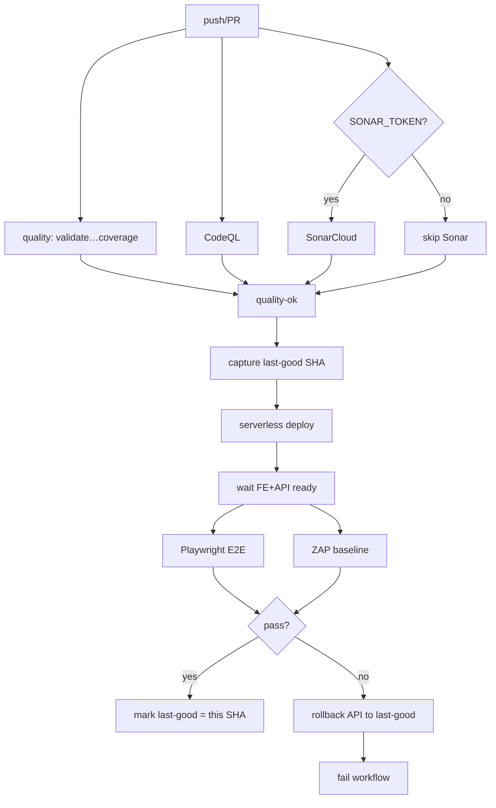

# Plan técnico — Post-deploy E2E + OWASP + quality + rollback

## Decisiones (ADR 0012)

| Tema | Elección | Por qué |
|---|---|---|
| E2E browser | **Playwright** | Gratis, Actions oficial, mejor DX SPA que Selenium |
| SAST gratis | **CodeQL** (+ SonarCloud opcional) | Nativo GH; SonarQube CE self-host fuera de alcance |
| OWASP live | **ZAP baseline** action | Gratis, OWASP, post-deploy |
| Rollback API | Redeploy SHA last-good | SF4/CloudFormation no “undo” limpio tras UPDATE_COMPLETE |

## Arquitectura del pipeline

## Cambios concretos

1. **ADR 0012** — Playwright, CodeQL/SonarCloud, ZAP, rollback por SHA.
2. **`.github/workflows/ci.yml`** — job `codeql` (+ `sonar` opcional) en el camino a `quality-ok`.
3. **`.github/workflows/codeql.yml`** o jobs embebidos en `ci.yml` (preferir embebido para que `workflow_call` espere CodeQL).
4. **`apps/web` / `e2e/`** — Playwright tests + config; scripts root `test:e2e`.
5. **`deploy-api.yml`** — jobs `baseline`, `smoke` (Playwright+ZAP), `rollback` on failure; actualizar variable/artifact last-good.
6. **`deploy-feature.yml`** — smoke post-deploy (rollback al SHA del mismo run anterior del branch si existe; opcional más laxo).
7. **Scripts** — `scripts/ci/wait-http-ready.cjs`, `scripts/ci/resolve-last-good-sha.cjs`, `scripts/ci/rollback-api.sh`.
8. **Docs** — INDEX, CHANGELOG, current-state, README sección CI/CD, `docs/ci-cd.md`.

## Secrets / vars

| Name | Uso |
|---|---|
| `FE_BASE_URL` (var) | URL Amplify prod para E2E |
| `SONAR_TOKEN` (secret, opcional) | SonarCloud |
| `SONAR_ORGANIZATION` / `SONAR_PROJECT_KEY` (vars, opcionales) | SonarCloud |
| Existentes AWS / payment / Amplify | sin cambios de marca |

## Riesgos

- Flake E2E (pasarela sandbox lenta) → timeouts + retries Playwright; card fake en feature.
- Primer deploy sin last-good → no rollback automático.
- Amplify lag → poll readiness antes de E2E.

## Orden de implementación

Ver `tasks.md`.
