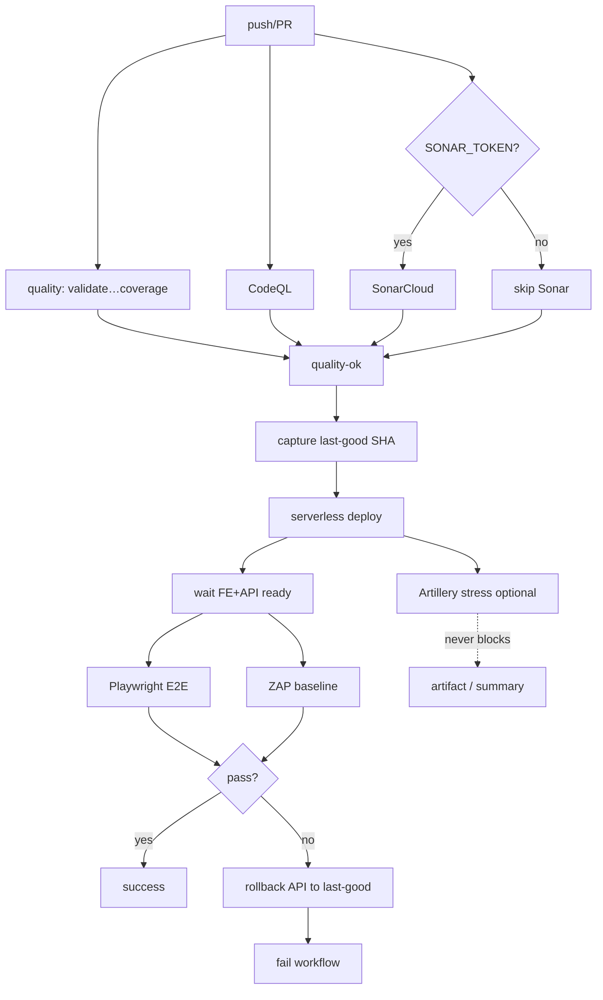

# Plan técnico — Post-deploy E2E + OWASP + quality + rollback

## Decisiones (ADR 0012 + 0013)

| Tema | Elección | Por qué |
|---|---|---|
| E2E browser | **Playwright** | Gratis, Actions oficial, mejor DX SPA que Selenium |
| SAST gratis | **CodeQL** (+ SonarCloud opcional) | Nativo GH; SonarQube CE self-host fuera de alcance |
| OWASP live | **ZAP baseline** action | Gratis, OWASP, post-deploy |
| Rollback API | Redeploy SHA last-good | SF4/CloudFormation no “undo” limpio tras UPDATE_COMPLETE |
| Stress | **Artillery** (`continue-on-error`) | Ligero; no bloquea deploy ni rollback (ADR 0013) |

## Arquitectura del pipeline

## Cambios concretos

1. ADR 0012 / 0013.
2. `ci.yml` — CodeQL + Sonar opcional → quality-ok.
3. Playwright `e2e/` + `test:e2e`.
4. `load/artillery-products.yml` + `test:stress`.
5. `deploy-api.yml` / `deploy-feature.yml` — smoke + stress (`continue-on-error`) + rollback solo desde smoke.
6. Scripts CI + `docs/ci-cd.md`.

## Secrets / vars

| Name | Uso |
|---|---|
| `FE_BASE_URL` | Amplify prod E2E |
| `SONAR_*` | SonarCloud opcional |
| `STRESS_ENABLED` | `false` omite Artillery |
| AWS / payment / Amplify | existentes |

## Riesgos

- Flake E2E / Amplify lag → timeouts.
- Stress agresivo → costos; mitigado con escenario corto.

## Orden

Ver `tasks.md`.
